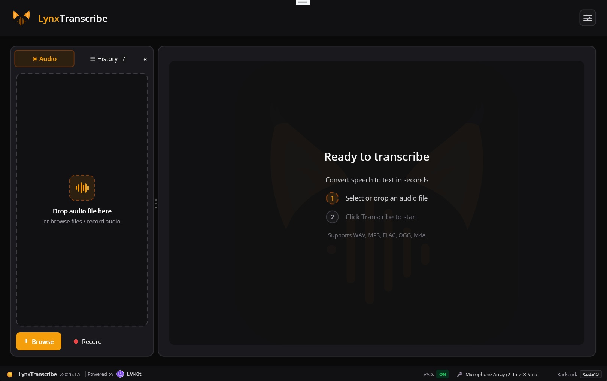
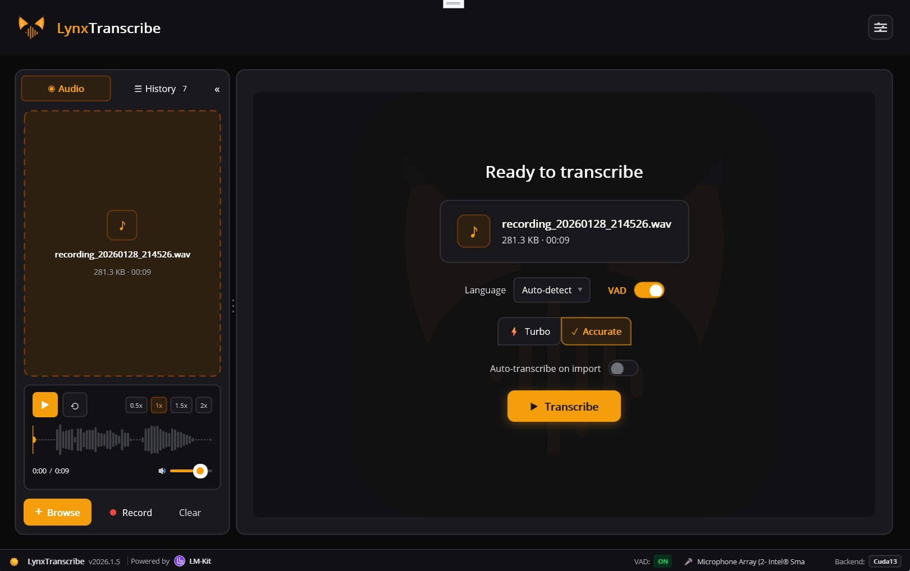
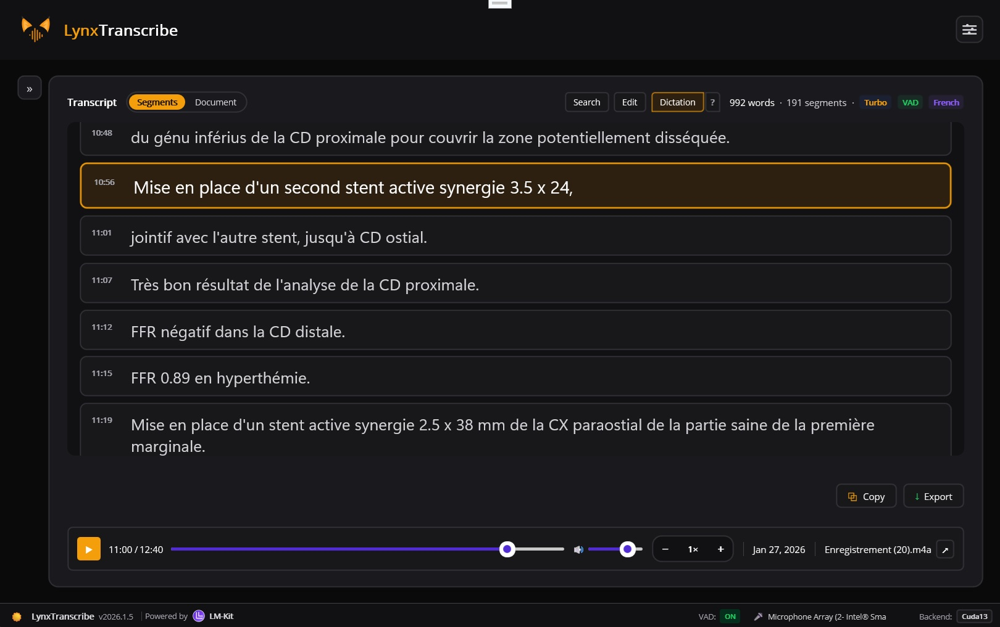

<p align="center">
  
</p>

<h1 align="center">LynxTranscribe</h1>

<p align="center">
  <strong>Fast, private, offline audio transcription powered by AI</strong>
</p>

<p align="center">
  <a href="#features">Features</a> •
  <a href="#screenshots">Screenshots</a> •
  <a href="#usage">Usage</a> •
  <a href="#building">Building</a> •
  <a href="#architecture">Architecture</a> •
  <a href="#license">License</a>
</p>

---

## Overview

LynxTranscribe is a cross-platform desktop application for transcribing audio files and recordings using state-of-the-art AI speech recognition. Built with .NET MAUI and powered by [LM-Kit](https://lm-kit.com/), it runs entirely on your local machine - no cloud services, no subscriptions, complete privacy.

### Why LynxTranscribe?

- **100% Offline** - Your audio never leaves your computer
- **Fast** - Optimized for speed with turbo and accurate modes
- **Private** - No data collection, no cloud processing
- **Cross-platform** - Runs on Windows and macOS

## Screenshots

<p align="center">
  
  <br>
  <em>Clean interface ready to receive audio files via drag & drop</em>
</p>

<p align="center">
  
  <br>
  <em>Audio file loaded with transcription options: language selection, VAD, and quality modes</em>
</p>

<p align="center">
  
  <br>
  <em>Transcription results displayed in segment view with timestamps and audio playback</em>
</p>

## Features

### Core Transcription
- **File Transcription** - Drag & drop or browse to transcribe audio files
- **Live Recording** - Record and transcribe directly from your microphone
- **Multiple Formats** - Supports WAV, MP3, FLAC, OGG, M4A, WMA

### Smart Processing
- **Voice Activity Detection (VAD)** - Automatically detects speech segments
- **Dictation Formatting** - Intelligent punctuation and capitalization
- **Multi-language Support** - Transcribe in 99+ languages

### User Experience
- **Segment View** - Navigate transcription by time-stamped segments
- **Document View** - View as continuous formatted text
- **Audio Playback** - Built-in player with waveform visualization
- **Click-to-Seek** - Click any segment to jump to that position

### Export Options
- **Plain Text** (.txt)
- **Subtitles** (.srt, .vtt)
- **Documents** (.docx, .rtf)

### Customization
- **Dark/Light Theme** - Easy on the eyes, day or night
- **Adjustable Font Size** - Zoom in/out with Ctrl+Mouse wheel
- **Resizable Panels** - Customize your workspace
- **Language Selection** - UI available in English and French

## Usage

### Transcribing a File

1. **Drag & drop** an audio file onto the application, or click **Browse** to select one
2. Click **Transcribe** to start
3. View results in segment or document mode
4. **Export** to your preferred format

### Recording Audio

1. Select your **microphone** from the dropdown
2. Click the **Record** button (3-second countdown)
3. Speak clearly into your microphone
4. Click **Stop** when finished
5. Transcription starts automatically (if auto-transcribe is enabled)

### Keyboard Shortcuts

| Shortcut | Action |
|----------|--------|
| `Ctrl + O` | Open audio file |
| `Ctrl + S` | Export transcription |
| `Ctrl + Mouse Wheel` | Adjust font size |
| `Space` | Play/Pause audio |
| `←` / `→` | Seek backward/forward 5s |

## Building

### Prerequisites

- **Windows**: Visual Studio 2022 (17.8+) with .NET MAUI workload
- **macOS**: Visual Studio for Mac or JetBrains Rider
- .NET 10.0 SDK

### Clone & Build

```bash
git clone https://github.com/user/lynxtranscribe.git
cd lynxtranscribe
dotnet restore
dotnet build
```

### Run

```bash
dotnet run --project LynxTranscribe.csproj
```

### Publish (Windows)

```bash
dotnet publish -c Release -f net10.0-windows10.0.19041.0 -r win-x64
```

### Publish (macOS)

```bash
dotnet publish -c Release -f net10.0-maccatalyst -r maccatalyst-x64
```

## Architecture

```
LynxTranscribe/
├── Controls/           # Custom UI controls
├── Helpers/            # Utility classes
│   ├── TranscriptExporter.cs
│   ├── WaveformDrawable.cs
│   ├── WhisperLanguages.cs
│   └── ...
├── Localization/       # Multi-language support
├── Models/             # Data models
│   └── TranscriptionRecord.cs
├── Services/           # Business logic
│   ├── AppSettingsService.cs
│   ├── AudioPlayerService.cs
│   ├── AudioRecorderService.cs
│   ├── LMKitService.cs
│   └── TranscriptionHistoryService.cs
├── MainPage.xaml       # Main UI
├── MainPage.*.cs       # Partial classes for organization
└── AppConstants.cs     # Application-wide constants
```

### Technology Stack

| Component | Technology |
|-----------|------------|
| UI Framework | .NET MAUI |
| AI Engine | [LM-Kit](https://lm-kit.com/) |
| Audio Playback | NAudio |
| Audio Recording | NAudio |
| Export | DocX, custom formatters |

## Configuration

Settings are stored in user preferences and include:

- **Model Mode** - Turbo (faster) or Accurate (better quality)
- **Voice Activity Detection** - Enable/disable VAD
- **Dictation Formatting** - Auto-punctuation and capitalization
- **Storage Paths** - Custom locations for models, history, recordings
- **Theme** - Dark or light mode
- **Language** - UI language preference

## License

This project is licensed under the **GNU General Public License v3.0 (GPL-3.0)**.

Alternative licensing options are available for commercial use or custom integrations. Please [contact us](mailto:contact@example.com) to discuss your needs.

See the [LICENSE](LICENSE) file for details.

## Acknowledgments

- [LM-Kit](https://lm-kit.com/) - On-device AI inference SDK
- [NAudio](https://github.com/naudio/NAudio) - Audio library for .NET
- [.NET MAUI](https://dotnet.microsoft.com/apps/maui) - Cross-platform UI framework

---

<p align="center">
  Made with ❤️ for privacy-conscious users
</p>
